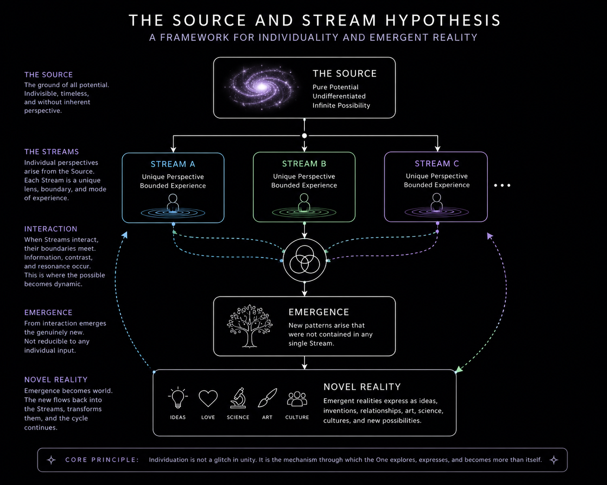

# The Source and the Stream

> A philosophical framework exploring individuality, emergence, and the creation of genuinely new reality.
## Conceptual Overview

## Overview

**The Source and the Stream** proposes that individuality is not an accident or an illusion—it is the mechanism through which reality produces genuine novelty.

Rather than beginning with religion or physics, this project starts with a simple question:

> Why are there many conscious individuals instead of only one?

This repository documents the current development of that idea.

---

## Reading Order

### 1. One-Page Summary
A quick introduction to the central concept.
- [One-Page Summary](docs/Source_and_Stream_One_Page_v0.1.pdf)
  
### 2. Short Version
An expanded explanation of the framework and its core arguments.
- [Short Version](docs/Source_and_Stream_Short_v0.1.pdf)
  
### 3. Full Theory
The complete manuscript.
- [Full Theory](docs/Source_and_Stream_Full_v0.1.pdf)
  

## Current Status

**Version:** v0.1

This project is actively being refined and expanded.

Feedback, criticism, and thoughtful discussion are welcome.

---

## License

Copyright © 2026

All rights reserved unless otherwise stated.
